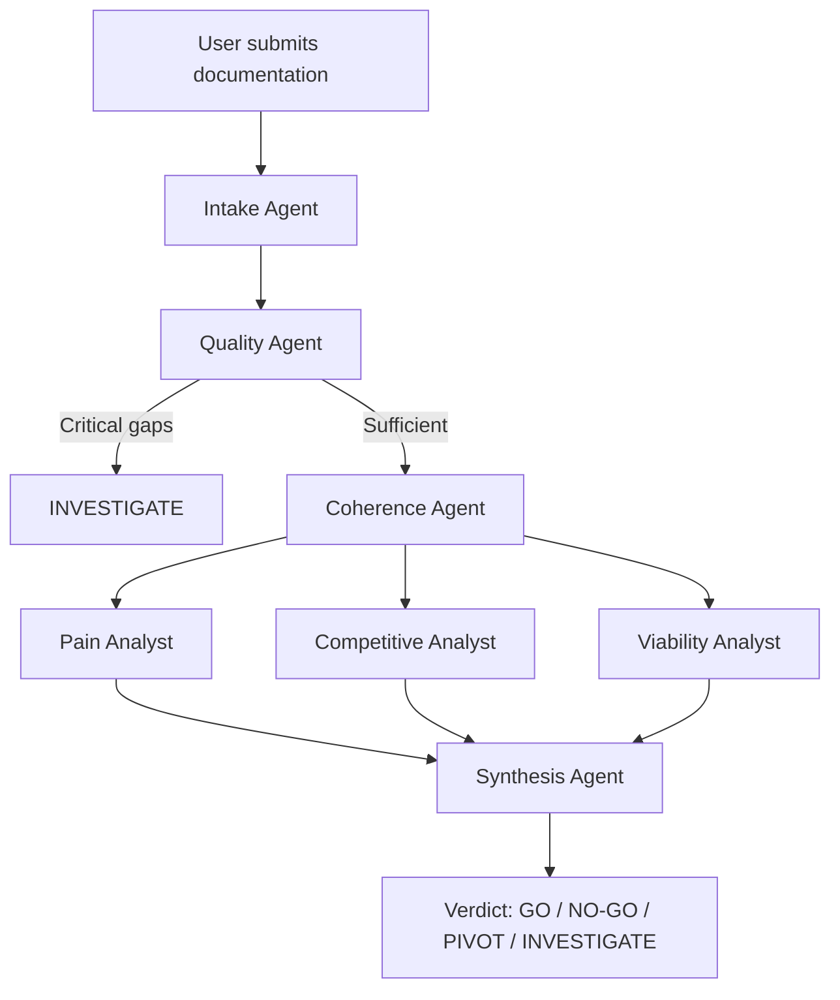

# Dokma — Evidence-Based Idea Validation

[](https://python.org)
[](https://langchain-ai.github.io/langgraph/)
[](LICENSE)
[]()

> 🇧🇷 [Leia em Português](README.pt-br.md)

---

## What is Dokma

Dokma is a multi-agent system that validates product ideas based on real research documentation — not assumptions. Before any analysis runs, the system audits the quality and coverage of the submitted documentation. If the evidence isn't there, the system says so explicitly instead of producing confident-sounding output based on nothing.

The core differentiator is architectural: **Dokma refuses to analyze what hasn't been documented.**

---

## Why It's Different

Most AI-powered idea validation tools work like this: you describe your idea in a paragraph, and the model generates a structured analysis. The output looks rigorous. It rarely is.

| Feature | ValidatorAI / DimeADozen | Dokma |
|---|---|---|
| Input required | 1-2 paragraph description | Research documentation |
| Evidence audit | ❌ | ✅ Mandatory before analysis |
| Inconsistency detection | ❌ | ✅ Cross-references internal claims |
| Document weight classification | ❌ | ✅ Technical docs ignored automatically |
| Verdict confidence signal | ❌ | ✅ Explicit reliability rating |
| Blocks analysis on weak evidence | ❌ | ✅ INVESTIGATE verdict |

---

## How It Works

Dokma runs a pipeline of specialized agents, each with a single responsibility:



**Intake Agent** — Classifies the idea using four markers (product type, business model, maturity stage, Sequoia archetype) and assigns analytical weight to each submitted document. Technical documentation receives zero weight and is excluded from analysis.

**Quality Agent** — Audits coverage and internal consistency using only documents with HIGH or MEDIUM weight. Calculates an alert level (CRITICAL, MODERATE, INFORMATIVE) that controls whether analysis proceeds.

**Coherence Agent** — Determines which analytical framework carries the most weight for this specific idea: Mom Test, Paul Graham / YC, or Teresa Torres' Continuous Discovery.

**Analysis Agents** — Three independent agents evaluate pain validation, competitive landscape, and execution viability using only relevant documents.

**Synthesis Agent** — Integrates the three analyses and emits a single, justified verdict.

---

## The Four Verdicts

| Verdict | Meaning |
|---|---|
| **GO** | Problem is real, evidence is sufficient for the current stage, no fatal contradictions |
| **NO-GO** | Problem lacks empirical support — no recoverable core |
| **PIVOT** | Real pain exists but the proposed solution is wrong — wrong segment, channel, format, or model |
| **INVESTIGATE** | Critical gaps prevent reliable analysis — specific actions required before resubmission |

---

## Tech Stack

- **Python 3.13**
- **LangGraph** — stateful agent orchestration with conditional routing
- **Streamlit** — local web interface
- **SQLite + SQLAlchemy** — local persistence, PostgreSQL-compatible schema
- **Anthropic Claude API** — all agents use Claude Sonnet

---

## Running Locally

**Prerequisites**
- Python 3.13+
- Anthropic API key

**Setup**

```bash
# Clone the repository
git clone https://github.com/NiniePetrov/dokma.git
cd dokma

# Create and activate virtual environment
python -m venv venv
venv\Scripts\activate  # Windows
source venv/bin/activate  # macOS/Linux

# Install dependencies
pip install -r requirements.txt

# Configure environment
cp .env.example .env
# Add your Anthropic API key to .env

# Run
streamlit run main.py
```

---

## Architectural Decisions

**Why require documentation before analysis**
Tools that accept minimal input produce minimal-quality analysis dressed up as rigor. The documentation requirement creates productive friction — if you can't fill the research blocks, the idea gets archived before wasting execution time.

**Why LangGraph over a single prompt**
Each agent has a single, auditable responsibility. When the system produces an incorrect verdict, the failure is traceable to a specific agent with a specific input. A single prompt produces opaque failures.

**Why Claude for all agents**
Initial development used a local Qwen model to avoid API costs. Qwen produced hallucinated document classifications and contaminated analyses when processing multiple long documents. Claude's larger context window and stronger reasoning eliminated both failure modes.

**Why SQLite with PostgreSQL-compatible schema**
The system is designed to scale. Local SQLite removes infrastructure dependencies during development. The schema avoids SQLite-specific features so migration to PostgreSQL requires only a connection string change.

---

## Roadmap

- [ ] Implementation Agent — contextual execution roadmap separated from documentation improvement instructions
- [ ] Founder-Market Fit module — independent agent system evaluating founder-market compatibility
- [ ] Hybrid research mode — competitive analysis agent with autonomous web search capability
- [ ] Multi-user support with authentication
- [ ] PostgreSQL migration for hosted deployment

---

## Author

**Weberson Azemclever**
Prompt Engineer | LLM Behavior Analysis | Applied Cognitive Biases in AI

[](https://linkedin.com/in/weberson-azemclever)
[](https://substack.com/@stranight)

---

*Dokma is under active development. The name is provisional.*