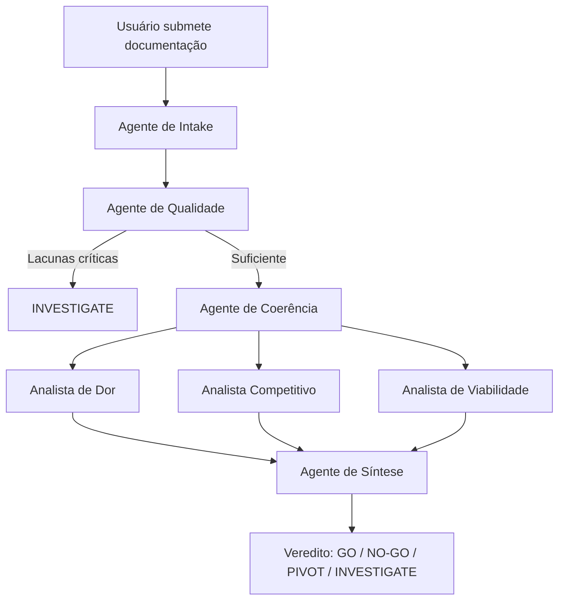

# Dokma — Validação de Ideias Baseada em Evidência

[](https://python.org)
[](https://langchain-ai.github.io/langgraph/)
[](LICENSE)
[]()

> 🇺🇸 [Read in English](README.md)

---

## O que é o Dokma

Dokma é um sistema multi-agente que valida ideias de produto com base em documentação de pesquisa real — não em suposições. Antes de qualquer análise ser executada, o sistema audita a qualidade e a cobertura da documentação submetida. Se a evidência não está lá, o sistema diz isso explicitamente em vez de produzir output que parece rigoroso mas é baseado em nada.

O diferencial central é arquitetural: **o Dokma se recusa a analisar o que não foi documentado.**

---

## Por que é diferente

A maioria das ferramentas de validação de ideias com IA funciona assim: você descreve sua ideia em um parágrafo, e o modelo gera uma análise estruturada. O output parece rigoroso. Raramente é.

| Funcionalidade | ValidatorAI / DimeADozen | Dokma |
|---|---|---|
| Input exigido | Descrição em 1-2 parágrafos | Documentação de pesquisa |
| Auditoria de evidência | ❌ | ✅ Obrigatória antes da análise |
| Detecção de inconsistências | ❌ | ✅ Cruza afirmações internas |
| Classificação de peso de documentos | ❌ | ✅ Docs técnicos ignorados automaticamente |
| Sinal de confiabilidade do veredito | ❌ | ✅ Rating explícito de confiabilidade |
| Bloqueia análise com evidência fraca | ❌ | ✅ Veredito INVESTIGATE |

---

## Como funciona

O Dokma executa um pipeline de agentes especializados, cada um com responsabilidade única:



**Agente de Intake** — Classifica a ideia com quatro marcadores (tipo de produto, modelo de negócio, estágio de maturidade, arquétipo Sequoia) e atribui peso analítico a cada documento submetido. Documentação técnica recebe peso zero e é excluída da análise.

**Agente de Qualidade** — Audita cobertura e consistência interna usando apenas documentos com peso ALTO ou MEDIO. Calcula um nível de alerta (CRÍTICO, MODERADO, INFORMATIVO) que controla se a análise prossegue.

**Agente de Coerência** — Determina qual framework analítico tem maior peso para aquela ideia específica: Mom Test, Paul Graham / YC, ou Continuous Discovery de Teresa Torres.

**Agentes de Análise** — Três agentes independentes avaliam validação de dor, cenário competitivo e viabilidade de execução usando apenas os documentos relevantes.

**Agente de Síntese** — Integra as três análises e emite um veredito único e justificado.

---

## Os quatro vereditos

| Veredito | Significado |
|---|---|
| **GO** | Problema real, evidência suficiente para o estágio atual, sem contradição fatal |
| **NO-GO** | Problema sem sustentação empírica — nenhum núcleo aproveitável |
| **PIVOT** | Dor real mas solução errada — errou segmento, canal, formato ou modelo |
| **INVESTIGATE** | Lacunas críticas impedem análise confiável — ações específicas necessárias antes de resubmissão |

---

## Stack técnica

- **Python 3.13**
- **LangGraph** — orquestração stateful de agentes com roteamento condicional
- **Streamlit** — interface web local
- **SQLite + SQLAlchemy** — persistência local, schema compatível com PostgreSQL
- **Anthropic Claude API** — todos os agentes usam Claude Sonnet

---

## Rodando localmente

**Pré-requisitos**
- Python 3.13+
- Chave de API da Anthropic

**Instalação**

```bash
# Clonar o repositório
git clone https://github.com/NiniePetrov/validador-ideias.git
cd validador-ideias

# Criar e ativar ambiente virtual
python -m venv venv
venv\Scripts\activate  # Windows
source venv/bin/activate  # macOS/Linux

# Instalar dependências
pip install -r requirements.txt

# Configurar ambiente
cp .env.example .env
# Adicione sua chave da API Anthropic no .env

# Rodar
streamlit run main.py
```

---

## Decisões arquiteturais

**Por que exigir documentação antes da análise**
Ferramentas que aceitam input mínimo produzem análise de qualidade mínima disfarçada de rigor. A exigência de documentação cria atrito produtivo — se você não consegue preencher os blocos de pesquisa, a ideia é arquivada antes de desperdiçar tempo de execução.

**Por que LangGraph em vez de um prompt único**
Cada agente tem uma responsabilidade única e auditável. Quando o sistema produz um veredito incorreto, a falha é rastreável a um agente específico com um input específico. Um prompt único produz falhas opacas.

**Por que Claude para todos os agentes**
O desenvolvimento inicial usou um modelo Qwen local para evitar custos de API. O Qwen produziu classificações alucinadas de documentos e análises contaminadas ao processar múltiplos documentos longos. A janela de contexto maior e o raciocínio mais sólido do Claude eliminaram ambos os modos de falha.

**Por que SQLite com schema compatível com PostgreSQL**
O sistema foi projetado para escalar. SQLite local remove dependências de infraestrutura durante o desenvolvimento. O schema evita features exclusivas do SQLite para que a migração para PostgreSQL exija apenas uma mudança na string de conexão.

---

## Roadmap

- [ ] Agente de Implementação — roadmap contextual de execução separado das instruções de melhoria de documentação
- [ ] Módulo de Founder-Market Fit — sistema independente de agentes avaliando compatibilidade founder-mercado
- [ ] Modo híbrido de pesquisa — agente de análise competitiva com capacidade de busca autônoma na web
- [ ] Suporte multi-usuário com autenticação
- [ ] Migração para PostgreSQL para deploy hospedado

---

## Autor

**Weberson Azemclever**
Engenheiro de Prompt | Análise de Comportamento de LLMs | Vieses Cognitivos Aplicados à IA

[](https://linkedin.com/in/weberson-azemclever)
[](https://substack.com/@stranight)

---

*Dokma está em desenvolvimento ativo. O nome é provisório.*